

<table style="width: 100%; border: none; border-collapse: collapse; margin-bottom: 5px; font-family: 'Limon NU S1', 'Times New Roman', serif; font-size: 12pt;">
  <tr style="border: none;">
    <td style="text-align: left; font-weight: bold; border: none; padding: 0; color: #000000;" class="khmer-val">សាកលវិទ្យាល័យន័រតុន</td>
    <td style="text-align: right; font-weight: bold; border: none; padding: 0; color: #000000;" class="khmer-val">ដេប៉ាតឺម៉ង់ វិទ្យាសាស្ត្រកុំព្យូទ័រ</td>
  </tr>
</table>

<h2 class="khmer-val">ឧបសម្ព័ន្ធ គ៖ ការដំឡើងកម្មវិធី (Program Installation)</h2>

<h3 class="khmer-val">១. តម្រូវការប្រព័ន្ធ និងឧបករណ៍ (System Requirements)</h3>
<ul>
  <li class="khmer-val">Local WAMP Stack Server: Laragon Full (MySQL 8.0)</li>
  <li class="khmer-val">Windows OS (Windows 10 ឬ Windows 11 x64)</li>
  <li class="khmer-val">CPU: 2.0 GHz or higher (x64 processor)</li>
  <li class="khmer-val">RAM: Minimum 8 GB (16 GB Recommended)</li>
  <li class="khmer-val">Storage: Free HDD/SSD space at least 10 GB</li>
</ul>

<h3 class="khmer-val">២. របៀបដំឡើងកម្មវិធី Bun និង Node.js</h3>
<ul>
  <li class="khmer-val">ដើម្បីដំឡើង Bun និង Node.js សម្រាប់ការអភិវឌ្ឍន៍ប្រព័ន្ធ សូមអនុវត្តតាមជំហាន៖</li>
  <ol>
    <li class="khmer-val">ទាញយកកម្មវិធី Node.js ពីគេហទំព័រផ្លូវការ៖
       <a href="https://nodejs.org/" target="_blank">https://nodejs.org/en/download</a>
    </li>
    

      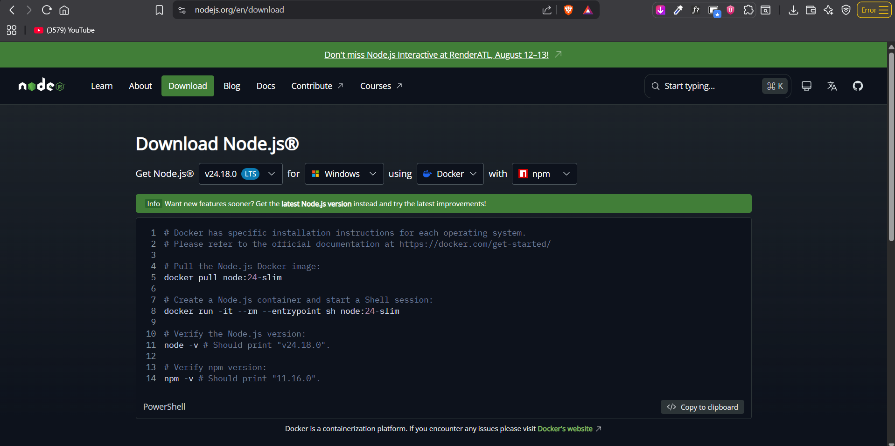
      រូបភាពទី១៖ ទាញយក Node.js LTS ពីគេហទំព័រផ្លូវការ
    

    <li class="khmer-val">ដំឡើង Node.js តាមរយៈការចុច Next រហូតដល់ចប់កម្មវិធីដំឡើង (Wizard Setup)។</li>
    

      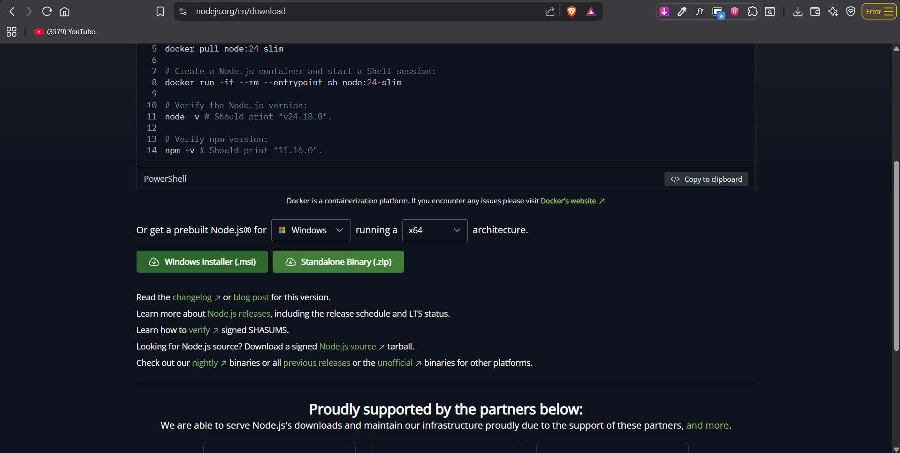
      រូបភាពទី២៖ ផ្ទាំងកម្មវិធីដំឡើង Node.js Setup Wizard
    

    
    

      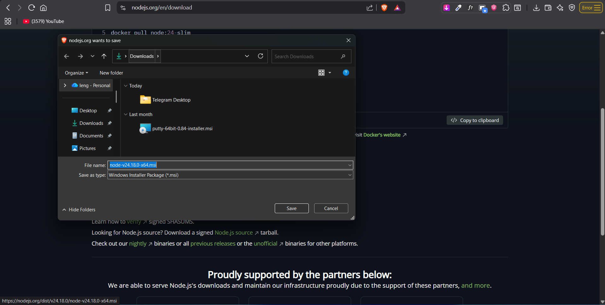
      រូបភាពទី៣៖ កម្មវិធី Node.js បានដំឡើងរួចរាល់ជាស្ថាពរ
    

    <li class="khmer-val">បើកកម្មវិធី PowerShell រួចដំណើរការកូដខាងក្រោមដើម្បីដំឡើង Bun Package Manager៖</li>
    
powershell -c "irm bun.sh/install.bat | iex"

    

      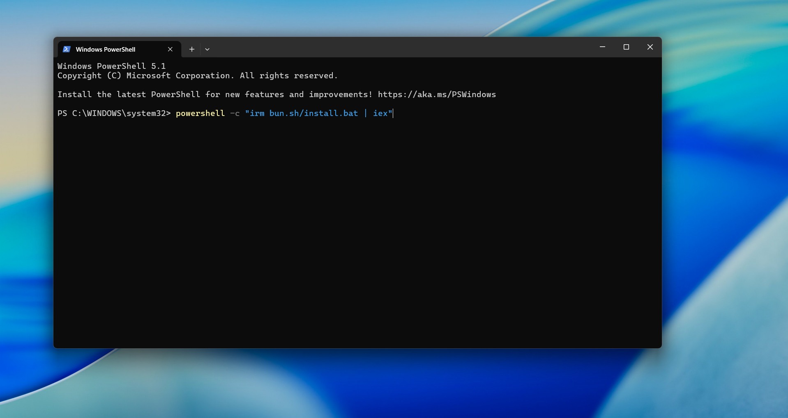
      រូបភាពទី៤៖ ដំណើរការបញ្ជា PowerShell ដើម្បីដំឡើង Bun
    

    <li class="khmer-val">ពិនិត្យមើលកំណែ Bun ដែលបានដំឡើងដោយវាយ៖</li>
    
bun --version

    

      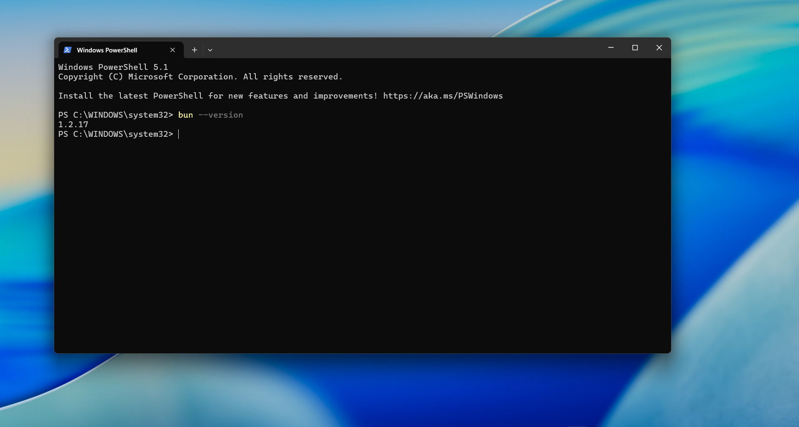
      រូបភាពទី៥៖ ការត្រួតពិនិត្យកំណែ (Version) របស់ Bun ក្នុង Terminal
    

  </ol>
</ul>

<h3 class="khmer-val">៣. របៀបដំឡើង និងរៀបចំ MySQL តាមរយៈ Laragon</h3>
<ul>
  <li class="khmer-val">ដើម្បីរៀបចំ database យ៉ាងងាយស្រួល ជាមួយកម្មវិធី Laragon និង HeidiSQL៖</li>
  <ol>
    <li class="khmer-val">ទាញយកកម្មវិធី Laragon Full (រួមមាន MySQL 8.0) ពីគេហទំព័រផ្លូវការ៖
       <a href="https://laragon.org/download/" target="_blank">https://laragon.org/download/</a>
    </li>
    

      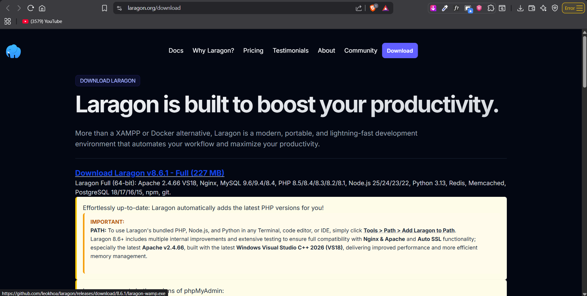
      រូបភាពទី៦៖ គេហទំព័រផ្លូវការសម្រាប់ទាញយក Laragon Full
    

    <li class="khmer-val">បើកកម្មវិធីដំឡើង Laragon រួចដំឡើងវា (ជាទូទៅដំឡើងក្នុងកញ្ចប់ <code>C:\laragon</code>)។</li>
    

      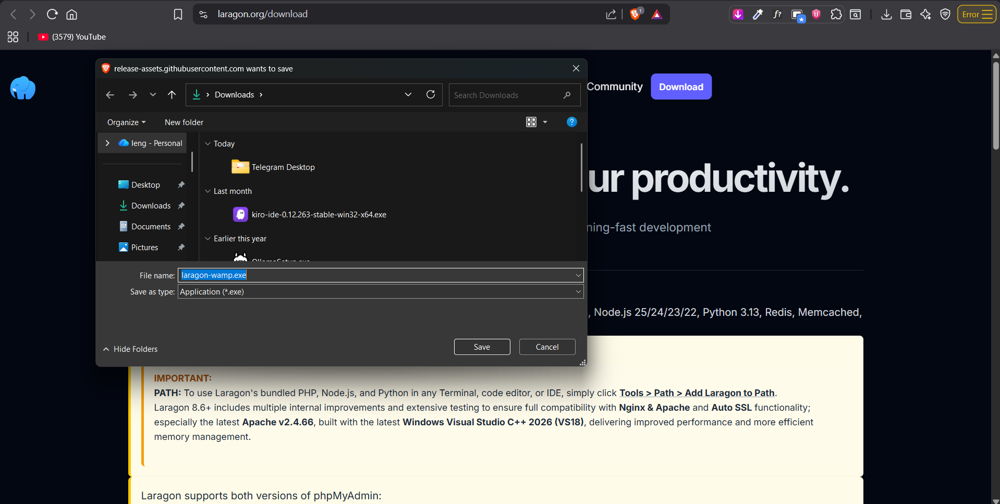
      រូបភាពទី៧៖ ការរក្សាទុកកម្មវិធីដំឡើង Laragon Setup WAMP
    

    
    <li class="khmer-val"><strong>កំណត់បណ្តាញ PATH (សំខាន់បំផុត)៖</strong> នៅក្នុងផ្ទាំងកម្មវិធី Laragon សូមចុចយក <strong>Tools &rarr; Path &rarr; Add Laragon to Path</strong> ដើម្បីឲ្យ Windows និង Terminal នៃ VS Code ស្គាល់រាល់កម្មវិធី Node.js, Python, PHP, និង Git ដោយស្វ័យប្រវត្ត។</li>
    
    <li class="khmer-val">បើកកម្មវិធី Laragon រួចចុចប៊ូតុង <strong>"Start All"</strong> ដើម្បីដំណើរការ MySQL database។</li>
    

      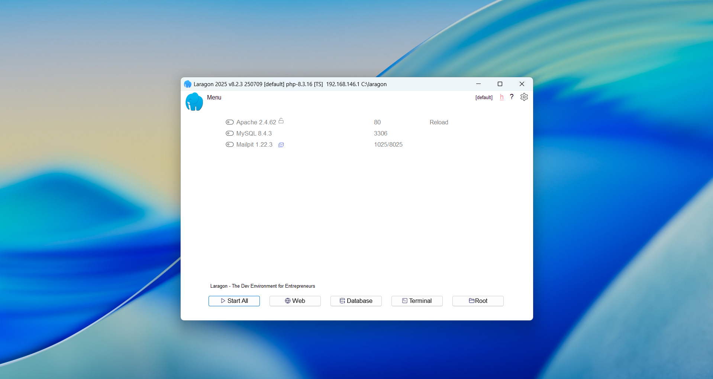
      រូបភាពទី៨៖ ផ្ទាំងគ្រប់គ្រង Laragon មុនពេលដំណើរការ (Start All)
    

    

      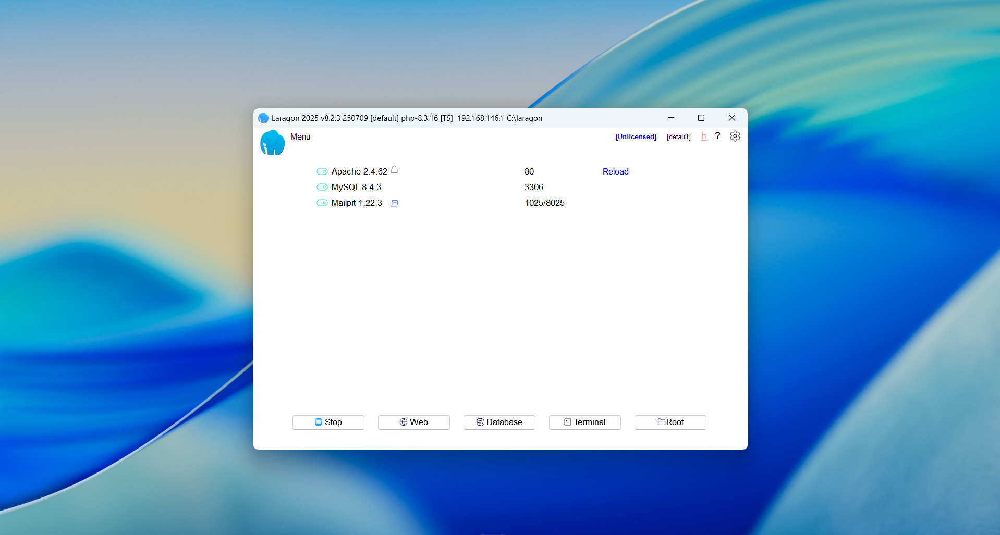
      រូបភាពទី៩៖ ផ្ទាំងគ្រប់គ្រង Laragon បន្ទាប់ពីការចាប់ផ្តើមសេវាកម្ម MySQL
    

    <li class="khmer-val">ចុចប៊ូតុង <strong>"Database"</strong> លើផ្ទាំង Laragon ដើម្បីបើកកម្មវិធី <strong>HeidiSQL</strong> រួចចុច <strong>"Open"</strong> (Username: <code>root</code>, password ទុកទទេ)។ <em>(សម្គាល់៖ អ្នកក៏អាចគ្រប់គ្រងតាមរយៈ browser បានដោយចុច Menu &rarr; MySQL &rarr; phpMyAdmin ផងដែរ)</em>។</li>
    

      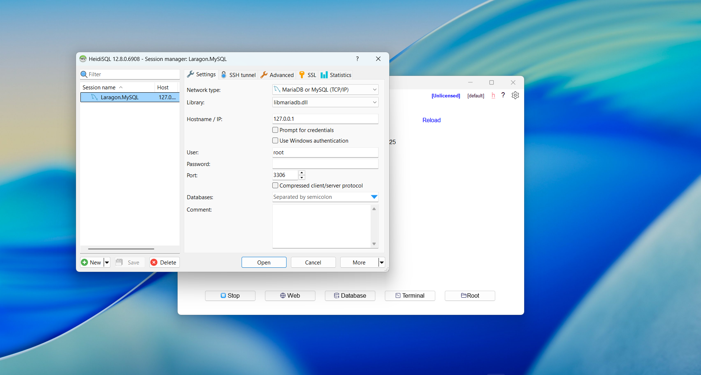
      រូបភាពទី១០៖ ការកំណត់ប៉ារ៉ាម៉ែត្រតភ្ជាប់ទៅកាន់ MySQL ក្នុងកម្មវិធី HeidiSQL Session Manager
    

    <li class="khmer-val">ចុចម៉ៅស្តាំ (Right-click) នៅក្នុងកម្មវិធី HeidiSQL រួចជ្រើសរើស <strong>Create new &rarr; Database</strong> បន្ទាប់មកដាក់ឈ្មោះ database ថា <code>hrms</code> និងកំណត់ប្រភេទ Collation យក <code>utf8mb4_unicode_ci</code>។</li>

    <li class="khmer-val">ជ្រើសរើស Database <code>hrms</code> រួចចុច <strong>File &rarr; Run SQL file...</strong> រួចរើសយកហ្វាយ <code>local_dump.sql</code> ពី folder គម្រោង ដើម្បីនាំចូលទិន្នន័យ។</li>
    

      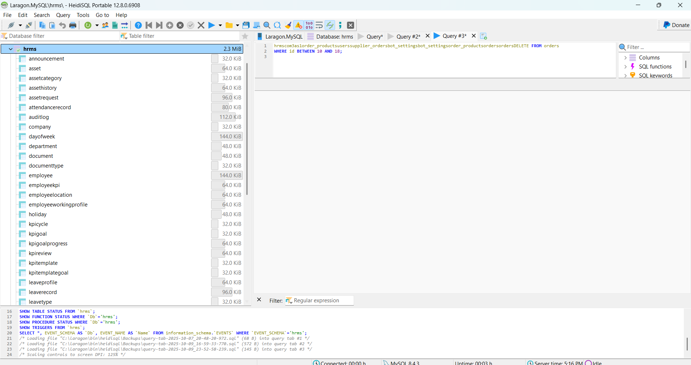
      រូបភាពទី១១៖ ផ្ទាំងទិន្នន័យរបស់ HeidiSQL បន្ទាប់ពីបង្កើត Database រួច និងនាំចូលតារាងទាំង ៤១ រួចរាល់
    

  </ol>
</ul>

<h3 class="khmer-val">៤. របៀបដំឡើងកម្មវិធី Docker Desktop</h3>
<ul>
  <li class="khmer-val">ដើម្បីដំណើរការប្រព័ន្ធទាំងអស់រួមគ្នាយ៉ាងឆាប់រហ័សតាម Docker៖</li>
  <ol>
    <li class="khmer-val">ទាញយកកម្មវិធី Docker Desktop ពីគេហទំព័រ៖
       <a href="https://www.docker.com/products/docker-desktop/" target="_blank">https://www.docker.com/products/docker-desktop/</a>
    </li>
    

      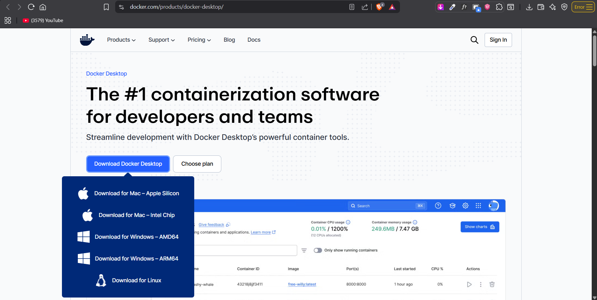
      រូបភាពទី១២៖ ទំព័រផ្លូវការសម្រាប់ទាញយកកម្មវិធី Docker Desktop
    

    
    

      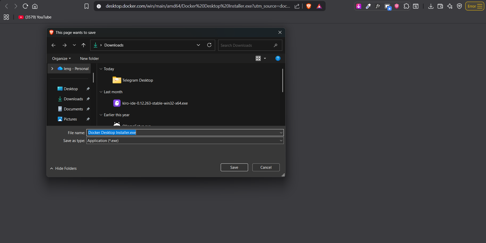
      រូបភាពទី១៣៖ ដំណើរការទាញយកកញ្ចប់ដំឡើង Docker Desktop
    

    <li class="khmer-val">ដំណើរការហ្វាយដំឡើង និងប្រាកដថាបានបើកសេវាកម្ម WSL 2 (Windows Subsystem for Linux)។</li>
    

      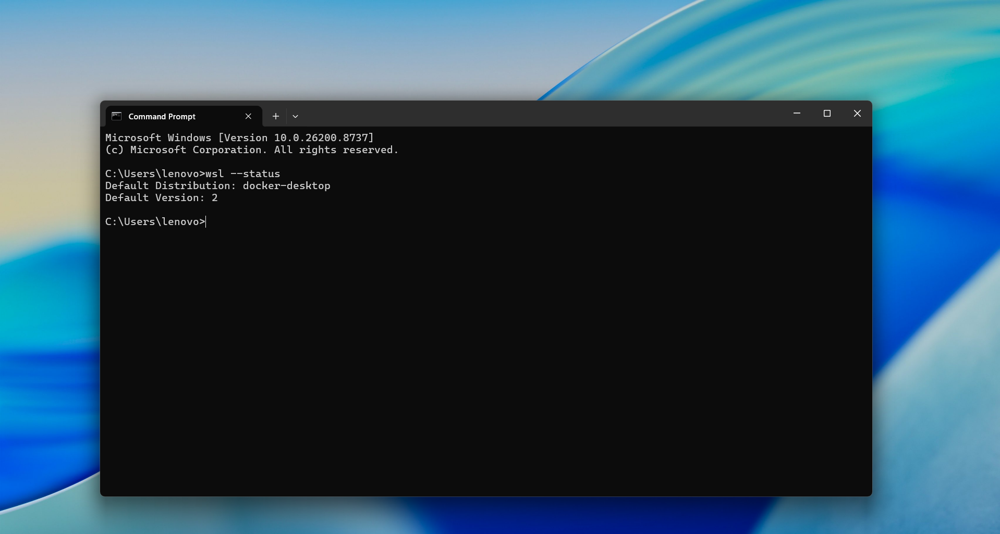
      រូបភាពទី១៤៖ ការត្រួតពិនិត្យដំណើរការ WSL ក្នុង Command Prompt (CMD)
    

    <li class="khmer-val">ដំណើរការ Docker Desktop រួចវាយកូដខាងក្រោមក្នុងគម្រោង ដើម្បីបង្កើត Container៖</li>
    
docker compose up --build -d

    

      
      រូបភាពទី១៥៖ ការវាយបញ្ជា docker compose up --build -d ក្នុងថតគម្រោង (Project Directory) លើ Terminal
    

    
    

      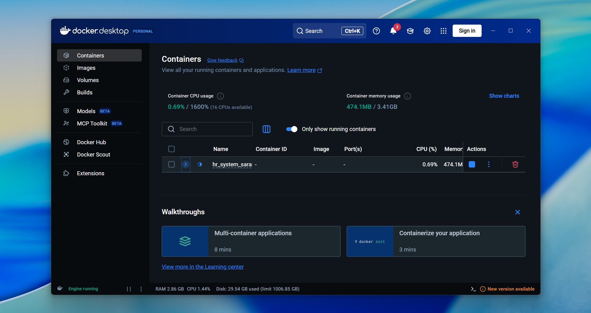
      រូបភាពទី១៦៖ ផ្ទាំងកម្មវិធី Docker Desktop បង្ហាញសេវាកម្ម (Containers) ដែលកំពុងដំណើរការ
    

  </ol>
</ul>

<h3 class="khmer-val">៥. របៀបដំឡើង Git សម្រាប់គ្រប់គ្រងកូដ</h3>
<ul>
  <li class="khmer-val">ដើម្បីទាញយកប្រភពកូដគម្រោង៖</li>
  <ol>
    <li class="khmer-val">ទាញយកកម្មវិធី Git សម្រាប់ Windows ពីគេហទំព័រ៖
       <a href="https://git-scm.com/download/win" target="_blank">https://git-scm.com/download/win</a>
    </li>
    

      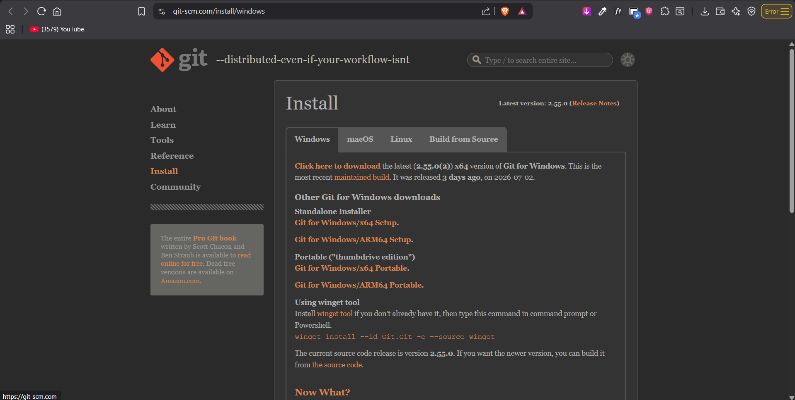
      រូបភាពទី១៧៖ ទំព័រផ្លូវការសម្រាប់ទាញយកកម្មវិធី Git សម្រាប់ Windows
    

    

      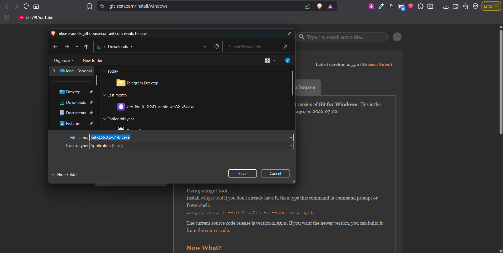
      រូបភាពទី១៨៖ ដំណើរការទាញយកកញ្ចប់ដំឡើង Git សម្រាប់ Windows
    

    <li class="khmer-val">បន្ទាប់ពីដំឡើងរួច បើក Terminal រួចដំណើរការ៖</li>
    
git clone &lt;repository-url&gt;

    

      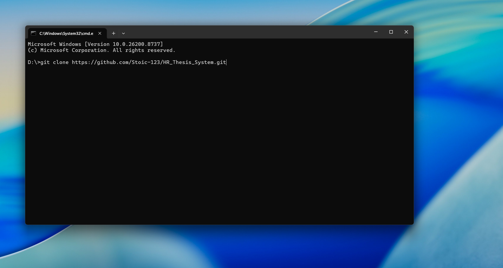
      រូបភាពទី១៩៖ ការវាយបញ្ជា git clone ដើម្បីទាញយកប្រភពកូដគម្រោងក្នុង Command Prompt
    

  </ol>
</ul>

<h3 class="khmer-val">៦. របៀបដំឡើងកម្មវិធី Expo Go លើទូរស័ព្ទដៃ</h3>
<ul>
  <li class="khmer-val">ដើម្បីដំណើរការសាកល្បងកម្មវិធីទូរស័ព្ទ (Mobile App) របស់បុគ្គលិក៖</li>
  <ol>
    <li class="khmer-val">បើកកម្មវិធី Google Play Store (Android) ឬ App Store (iOS) លើទូរស័ព្ទដៃរបស់អ្នក។</li>
    <li class="khmer-val">ស្វែងរកពាក្យថា "Expo Go" រួចចុចដំឡើង (Install)។</li>
    

      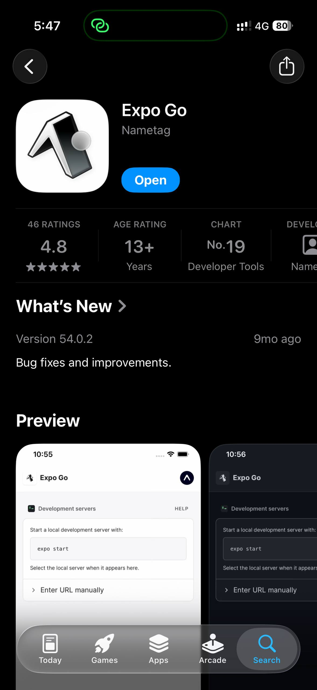
      រូបភាពទី២០៖ ការស្វែងរក និងដំឡើងកម្មវិធី Expo Go លើ App Store ឬ Google Play Store
    

    <li class="khmer-val">បើកកម្មវិធី Expo Go រួចស្កេន QR Code ដែលបង្ហាញចេញពីកុំព្យូទ័រអភិវឌ្ឍន៍ (តាមរយៈ <code>bunx expo start</code>)។</li>
    

      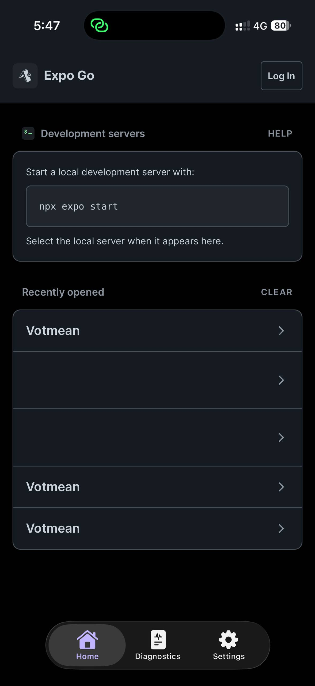
      រូបភាពទី២១៖ ទិដ្ឋភាពខាងក្នុងកម្មវិធី Expo Go បន្ទាប់ពីស្កេន QR Code រួចរាល់
    

  </ol>
</ul>
